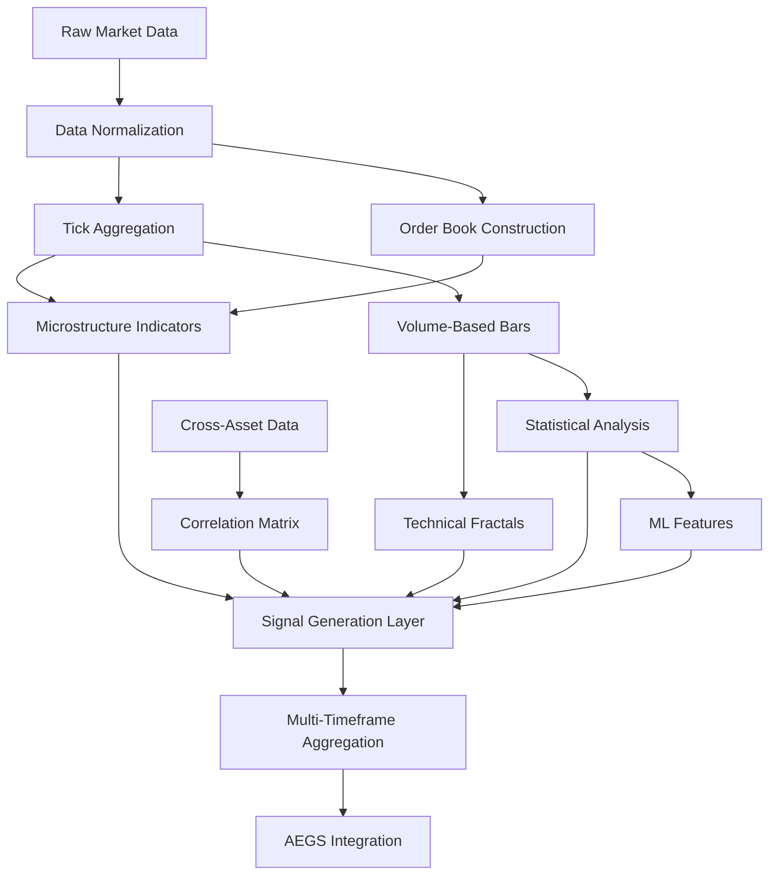

# 🏗️ Fractal Alpha Architecture & Planning Document

## 1. 📊 Data Architecture

### Data Requirements Matrix

| Indicator Type | Data Needed | Frequency | Storage | Source | Priority |
|---------------|-------------|-----------|---------|---------|----------|
| **Tick Volume Imbalance** | Tick-by-tick trades | < 1 second | 5GB/day/symbol | Level 2 data | HIGH |
| **Order Flow** | Order book snapshots | 100ms | 10GB/day/symbol | Exchange API | HIGH |
| **Bid-Ask Dynamics** | L2 quotes | 100ms | 2GB/day/symbol | Exchange API | HIGH |
| **Williams Fractals** | OHLC | 1min+ | 100MB/year | Standard API | MEDIUM |
| **Hurst Exponent** | Price series | Any | Minimal | Calculated | MEDIUM |
| **VPIN** | Volume-bucketed trades | Variable | 1GB/day | Tick data | HIGH |
| **Kyle's Lambda** | Trade impact data | Tick | 2GB/day | Exchange | MEDIUM |
| **Intraday Seasonality** | Historical OHLCV | 5min | 500MB/year | Standard API | LOW |
| **Volume Bars** | Cumulative volume | Tick | 1GB/day | Tick data | HIGH |
| **Cross-Asset** | Multiple symbols | 1min | 1GB/month | Various APIs | MEDIUM |

### Data Pipeline Design

```
[Raw Data Sources]
       ↓
[Data Ingestion Layer]
    ├── Tick Data Handler (Redis Queue)
    ├── OHLCV Handler (PostgreSQL)
    └── Order Book Handler (KDB+/Arctic)
       ↓
[Processing Layer]
    ├── Real-time Stream Processor
    ├── Batch Calculator
    └── Feature Store (Redis)
       ↓
[Indicator Layer]
    ├── Microstructure Module
    ├── Fractal Module
    └── ML Feature Module
       ↓
[Signal Generation]
       ↓
[AEGS Integration]
```

## 2. 🔧 System Architecture

### Component Hierarchy

```
FractalAlphaSystem/
├── DataLayer/
│   ├── TickDataManager
│   ├── OrderBookManager
│   ├── HistoricalDataManager
│   └── StreamProcessor
├── IndicatorEngine/
│   ├── BaseIndicator (Abstract)
│   ├── MicrostructureIndicators/
│   │   ├── TickVolumeImbalance
│   │   ├── OrderFlowDivergence
│   │   └── BidAskSpreadDynamics
│   ├── FractalIndicators/
│   │   ├── WilliamsFractal
│   │   ├── HurstExponent
│   │   └── DFA
│   ├── MarketMicrostructure/
│   │   ├── VPIN
│   │   ├── KylesLambda
│   │   └── AmihudRatio
│   ├── TimePatterns/
│   │   ├── IntradaySeasonality
│   │   ├── VolumeBarGenerator
│   │   └── RenkoBarGenerator
│   └── MLFeatures/
│       ├── EntropyCalculator
│       ├── WaveletDecomposer
│       └── HMMRegimeDetector
├── SignalCombiner/
│   ├── EnsembleVoter
│   ├── ConfidenceWeighter
│   └── TimeframeAggregator
└── BacktestFramework/
    ├── IndicatorTester
    ├── PerformanceAnalyzer
    └── OptimizationEngine
```

### Integration Points with AEGS

1. **Signal Flow**:
   ```python
   # Current AEGS signal generation
   if mean_reversion_score >= 50:
       signal = 1
   
   # Enhanced with fractal indicators
   fractal_score = self.fractal_engine.get_composite_score(df, timestamp)
   total_score = mean_reversion_score * 0.5 + fractal_score * 0.5
   
   if total_score >= 60:  # Higher threshold with more confidence
       signal = 1
       signal_confidence = min(total_score, 100)
   ```

2. **Multi-Timeframe Confirmation**:
   - 1-min: Microstructure signals
   - 5-min: Current AEGS signals
   - 15-min: Fractal confirmations
   - 1-hour: Regime filters

## 3. 💾 Performance & Scalability

### Memory Requirements

| Component | Memory Usage | Optimization Strategy |
|-----------|--------------|----------------------|
| Tick Data Buffer | 2GB per symbol | Ring buffer, 1hr window |
| Order Book Snapshots | 500MB per symbol | Compressed delta storage |
| Indicator Cache | 100MB per indicator | LRU cache with TTL |
| ML Models | 1GB total | Model quantization |
| Historical Data | 50GB total | Time-series database |

### Computational Complexity

| Indicator | Complexity | Optimization |
|-----------|------------|--------------|
| Tick Volume Imbalance | O(n) | Sliding window |
| Hurst Exponent | O(n log n) | FFT acceleration |
| VPIN | O(n) | Volume bucketing |
| Wavelets | O(n log n) | Pyramid algorithm |
| HMM | O(n²) | Viterbi pruning |

### Real-time Constraints

- Tick processing: < 10ms latency
- Indicator calculation: < 50ms per timeframe
- Signal generation: < 100ms total
- Order execution: < 200ms end-to-end

## 4. 🔗 Dependency Graph



### Critical Path Analysis

1. **Data Dependencies**:
   - Tick data → Volume bars → VPIN
   - Order book → Bid-ask spread → Kyle's Lambda
   - Price series → Returns → Hurst/DFA

2. **Calculation Dependencies**:
   - Basic indicators first (SMA, volume)
   - Complex indicators second (fractals, microstructure)
   - ML features last (need other features as input)

## 5. 🧪 Testing Strategy

### Unit Testing Framework

```python
class IndicatorTestCase:
    def __init__(self, indicator_class):
        self.indicator = indicator_class()
        self.synthetic_data = self.generate_test_data()
        self.real_data = self.load_historical_data()
    
    def test_edge_cases(self):
        # Empty data
        # Single data point
        # Extreme values
        # Missing data
        pass
    
    def test_performance(self):
        # Latency benchmarks
        # Memory usage
        # Throughput
        pass
    
    def test_accuracy(self):
        # Known patterns
        # Statistical properties
        # Comparison with reference implementation
        pass
```

### Integration Testing

1. **Data Flow Tests**:
   - End-to-end data pipeline
   - Latency measurements
   - Error handling

2. **Signal Quality Tests**:
   - Backtesting on historical data
   - Paper trading validation
   - A/B testing vs current AEGS

3. **Stress Testing**:
   - High-frequency data loads
   - Multiple symbol processing
   - Network disconnections

## 6. 🎯 Implementation Phases

### Phase 0: Foundation (Week 1)
- [ ] Design data schema
- [ ] Set up development environment
- [ ] Create base indicator interface
- [ ] Implement data pipeline skeleton
- [ ] Set up testing framework

### Phase 1: Core Infrastructure (Week 2)
- [ ] Build tick data manager
- [ ] Implement caching layer
- [ ] Create performance monitoring
- [ ] Set up CI/CD pipeline

### Phase 2: Basic Indicators (Week 3)
- [ ] Implement volume-based bars
- [ ] Add simple microstructure metrics
- [ ] Build Williams fractals
- [ ] Create basic ensemble logic

### Phase 3: Advanced Indicators (Week 4)
- [ ] Implement VPIN
- [ ] Add Hurst exponent
- [ ] Build ML feature extractors
- [ ] Create regime detection

### Phase 4: Integration & Optimization (Week 5)
- [ ] Integrate with AEGS
- [ ] Optimize performance bottlenecks
- [ ] Conduct comprehensive backtests
- [ ] Deploy to staging environment

### Phase 5: Production Rollout (Week 6)
- [ ] A/B testing framework
- [ ] Gradual rollout plan
- [ ] Monitoring and alerting
- [ ] Documentation and training

## 7. 📈 Success Metrics

### Technical Metrics
- Latency: < 100ms for signal generation
- Throughput: 100+ symbols simultaneously
- Accuracy: 65%+ win rate on backtests
- Uptime: 99.9% availability

### Business Metrics
- Sharpe Ratio improvement: +50%
- Max Drawdown reduction: -30%
- Win Rate improvement: +20%
- Profit Factor: > 1.5

### Risk Metrics
- False positive rate: < 10%
- Overfitting detection: Walk-forward analysis
- Correlation with existing signals: < 0.7
- Market impact: < 0.1% of daily volume

## 8. 🚨 Risk Considerations

### Technical Risks
1. **Data Quality**:
   - Missing ticks
   - Delayed data
   - Exchange outages

2. **Computational**:
   - CPU bottlenecks
   - Memory overflow
   - Network latency

3. **Model Risk**:
   - Overfitting
   - Regime changes
   - Black swan events

### Mitigation Strategies
1. **Redundancy**:
   - Multiple data providers
   - Fallback calculations
   - Circuit breakers

2. **Monitoring**:
   - Real-time dashboards
   - Anomaly detection
   - Performance tracking

3. **Graceful Degradation**:
   - Fallback to simpler indicators
   - Reduced position sizes
   - Manual override capability

## 9. 🔮 Future Enhancements

### Near-term (3 months)
- GPU acceleration for ML models
- Cloud-native deployment
- Real-time parameter adaptation

### Medium-term (6 months)
- Deep learning features
- Cross-exchange arbitrage
- Options market integration

### Long-term (1 year)
- Fully autonomous adaptation
- Multi-asset portfolio optimization
- Decentralized indicator marketplace

---

*"Proper planning prevents poor performance - especially when dealing with fractal market complexity!"* - Moon Dev 🌙