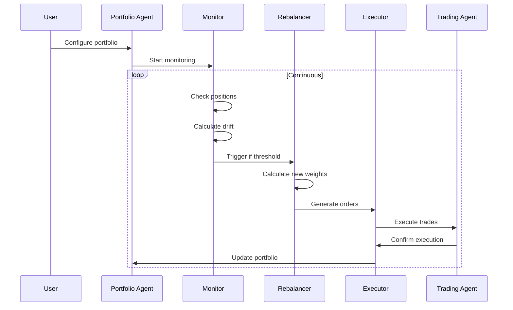

# Portfolio Rebalancing Agent - Detailed Design Document

## Executive Summary

The Portfolio Rebalancing Agent is an intelligent system that manages multiple trading strategies as a cohesive portfolio, automatically adjusting allocations based on performance, risk metrics, and user-defined targets. This agent addresses the critical need for portfolio-level risk management while enabling users to run multiple strategies from the Moon Dev marketplace simultaneously.

## Table of Contents

1. [Overview](#overview)
2. [Architecture Design](#architecture-design)
3. [Core Components](#core-components)
4. [Data Models](#data-models)
5. [Rebalancing Algorithms](#rebalancing-algorithms)
6. [Integration Points](#integration-points)
7. [Risk Management](#risk-management)
8. [User Interface](#user-interface)
9. [Implementation Plan](#implementation-plan)
10. [Testing Strategy](#testing-strategy)
11. [Future Enhancements](#future-enhancements)

## 1. Overview

### Purpose

The Portfolio Rebalancing Agent enables users to:
- Run multiple strategies with defined allocation targets
- Automatically rebalance based on drift, performance, or time
- Manage portfolio-level risk across all strategies
- Optimize allocations using various methodologies
- Track and analyze portfolio performance holistically

### Key Benefits

1. **Risk Diversification**: Spread risk across uncorrelated strategies
2. **Performance Optimization**: Dynamically adjust to favor winning strategies
3. **Automated Management**: No manual intervention needed for rebalancing
4. **Capital Efficiency**: Optimal use of available capital
5. **Educational Value**: Learn portfolio theory through practical application

## 2. Architecture Design

### High-Level Architecture

```
┌─────────────────────────────────────────────────────────────────┐
│                  Portfolio Rebalancing Agent                     │
├─────────────────────────────────────────────────────────────────┤
│                                                                 │
│  ┌──────────────────┐    ┌──────────────────┐    ┌──────────┐ │
│  │  Portfolio       │    │  Rebalancing     │    │  Risk    │ │
│  │  Monitor         │───▶│  Engine          │───▶│  Manager │ │
│  │                  │    │                  │    │          │ │
│  │ • Track positions│    │ • Calculate drift│    │ • Limits │ │
│  │ • Performance    │    │ • Generate orders│    │ • Checks │ │
│  │ • Correlations   │    │ • Optimize       │    │ • Alerts │ │
│  └──────────────────┘    └──────────────────┘    └──────────┘ │
│                                │                                │
│                                ▼                                │
│                    ┌──────────────────────┐                    │
│                    │  Execution Manager   │                    │
│                    │                      │                    │
│                    │ • Order batching     │                    │
│                    │ • Slippage minimize  │                    │
│                    │ • Transaction costs  │                    │
│                    └──────────────────────┘                    │
│                                │                                │
│  ┌──────────────────────────────────────────────────────────┐ │
│  │                    Integration Layer                       │ │
│  │                                                           │ │
│  │  Strategy Registry │ Trading Agent │ Risk Agent │ Market  │ │
│  └──────────────────────────────────────────────────────────┘ │
└─────────────────────────────────────────────────────────────────┘
```

### Component Flow



## 3. Core Components

### 3.1 Portfolio Monitor

```python
class PortfolioMonitor:
    """
    Continuously monitors portfolio state and performance
    """
    
    def __init__(self):
        self.positions = {}
        self.performance_history = []
        self.correlation_matrix = None
        self.last_rebalance = datetime.now()
    
    def update_positions(self):
        """Fetch current positions from all strategies"""
        
    def calculate_drift(self) -> Dict[str, float]:
        """Calculate deviation from target allocations"""
        
    def calculate_correlations(self, lookback_days: int = 30):
        """Calculate correlation matrix between strategies"""
        
    def check_triggers(self) -> List[str]:
        """Check if any rebalancing triggers are met"""
```

### 3.2 Rebalancing Engine

```python
class RebalancingEngine:
    """
    Core logic for portfolio rebalancing decisions
    """
    
    def __init__(self, method: str = "threshold"):
        self.method = method
        self.optimization_params = {}
    
    def calculate_target_weights(self, 
                               current_weights: Dict[str, float],
                               performance_data: pd.DataFrame,
                               constraints: Dict) -> Dict[str, float]:
        """Calculate optimal portfolio weights"""
        
    def generate_rebalancing_orders(self,
                                   current_positions: Dict,
                                   target_weights: Dict,
                                   total_portfolio_value: float) -> List[Order]:
        """Generate specific buy/sell orders"""
        
    def optimize_execution(self, orders: List[Order]) -> List[Order]:
        """Optimize order execution to minimize costs"""
```

### 3.3 Risk Manager

```python
class PortfolioRiskManager:
    """
    Portfolio-level risk management
    """
    
    def __init__(self):
        self.risk_limits = {
            "max_strategy_allocation": 0.4,  # 40% max per strategy
            "min_strategy_allocation": 0.05,  # 5% minimum
            "max_correlation": 0.7,           # Between any two strategies
            "max_portfolio_drawdown": 0.25,   # 25% max drawdown
            "min_sharpe_ratio": 0.5          # Minimum portfolio Sharpe
        }
    
    def validate_allocation(self, proposed_weights: Dict[str, float]) -> bool:
        """Validate proposed allocation meets risk criteria"""
        
    def calculate_portfolio_metrics(self) -> Dict[str, float]:
        """Calculate portfolio-level risk metrics"""
        
    def generate_risk_report(self) -> str:
        """Generate comprehensive risk report"""
```

## 4. Data Models

### Portfolio Configuration

```python
@dataclass
class PortfolioConfig:
    name: str
    target_allocations: Dict[str, float]  # strategy_id -> weight
    rebalancing_method: str  # "threshold", "calendar", "adaptive"
    rebalancing_params: Dict[str, Any]
    risk_limits: Dict[str, float]
    created_at: datetime
    updated_at: datetime
    
    def validate(self):
        """Ensure weights sum to 1.0 and meet constraints"""
        assert abs(sum(self.target_allocations.values()) - 1.0) < 0.001
```

### Rebalancing Event

```python
@dataclass
class RebalancingEvent:
    event_id: str
    timestamp: datetime
    trigger: str  # "drift", "calendar", "risk", "manual"
    pre_weights: Dict[str, float]
    post_weights: Dict[str, float]
    orders: List[Order]
    execution_summary: Dict
    performance_impact: Dict
```

### Strategy Performance

```python
@dataclass
class StrategyPerformance:
    strategy_id: str
    returns: pd.Series
    sharpe_ratio: float
    max_drawdown: float
    win_rate: float
    current_allocation: float
    target_allocation: float
    drift: float
```

## 5. Rebalancing Algorithms

### 5.1 Threshold Rebalancing

```python
def threshold_rebalancing(current_weights: Dict[str, float],
                         target_weights: Dict[str, float],
                         threshold: float = 0.05) -> bool:
    """
    Rebalance when any position drifts beyond threshold
    
    Example:
    - Target: 40% BTC strategy, 30% ETH, 30% SOL
    - Current: 45% BTC, 28% ETH, 27% SOL
    - Drift: 5% BTC (triggers rebalancing)
    """
    for strategy_id in target_weights:
        drift = abs(current_weights.get(strategy_id, 0) - target_weights[strategy_id])
        if drift > threshold:
            return True
    return False
```

### 5.2 Calendar Rebalancing

```python
def calendar_rebalancing(last_rebalance: datetime,
                        frequency: str = "monthly") -> bool:
    """
    Rebalance on a fixed schedule
    """
    frequencies = {
        "daily": timedelta(days=1),
        "weekly": timedelta(days=7),
        "monthly": timedelta(days=30),
        "quarterly": timedelta(days=90)
    }
    
    return datetime.now() - last_rebalance > frequencies[frequency]
```

### 5.3 Adaptive Rebalancing

```python
def adaptive_rebalancing(portfolio_metrics: Dict,
                        market_conditions: Dict) -> Dict[str, float]:
    """
    Dynamically adjust weights based on:
    - Strategy performance
    - Market volatility
    - Correlation changes
    - Risk metrics
    """
    # Increase weight to better performers
    # Reduce weight during high correlation
    # Adjust for market regime
    pass
```

### 5.4 Risk Parity

```python
def risk_parity_weights(returns: pd.DataFrame,
                       target_risk_contribution: float = None) -> Dict[str, float]:
    """
    Equal risk contribution from each strategy
    """
    covariance = returns.cov()
    n_assets = len(returns.columns)
    
    if target_risk_contribution is None:
        target_risk_contribution = 1.0 / n_assets
    
    # Optimization to find weights where each strategy
    # contributes equally to portfolio risk
    pass
```

## 6. Integration Points

### 6.1 Strategy Registry Integration

```python
def load_portfolio_strategies(portfolio_config: PortfolioConfig):
    """Load strategies from marketplace"""
    registry = StrategyRegistryAgent()
    strategies = {}
    
    for strategy_id in portfolio_config.target_allocations:
        strategy = registry.get_strategy(strategy_id)
        if strategy and strategy['status'] == 'active':
            strategies[strategy_id] = strategy
    
    return strategies
```

### 6.2 Trading Agent Integration

```python
def execute_rebalancing_trades(orders: List[Order]):
    """Execute trades through trading agent"""
    trading_agent = TradingAgent()
    
    # Batch orders for efficiency
    buy_orders = [o for o in orders if o.side == 'buy']
    sell_orders = [o for o in orders if o.side == 'sell']
    
    # Execute sells first to free up capital
    for order in sell_orders:
        trading_agent.execute_order(order)
    
    # Then execute buys
    for order in buy_orders:
        trading_agent.execute_order(order)
```

### 6.3 Risk Agent Integration

```python
def validate_with_risk_agent(proposed_portfolio: Dict):
    """Validate portfolio with risk agent"""
    risk_agent = RiskAgent()
    
    # Check portfolio-level risk
    portfolio_risk = calculate_portfolio_risk(proposed_portfolio)
    
    if not risk_agent.validate_portfolio_risk(portfolio_risk):
        raise RiskLimitExceeded("Portfolio risk exceeds limits")
```

## 7. Risk Management

### 7.1 Position Limits

```python
PORTFOLIO_RISK_LIMITS = {
    # Single strategy limits
    "max_single_strategy": 0.4,      # 40% max allocation
    "min_single_strategy": 0.05,     # 5% minimum (or 0)
    
    # Correlation limits
    "max_correlation_pair": 0.7,     # Max correlation between any two
    "max_avg_correlation": 0.5,      # Max average correlation
    
    # Performance limits
    "min_strategy_sharpe": 0.0,      # Remove negative Sharpe strategies
    "max_strategy_drawdown": 0.3,    # Remove if drawdown > 30%
    
    # Portfolio limits
    "max_portfolio_leverage": 1.0,   # No leverage initially
    "min_portfolio_sharpe": 0.5,     # Target portfolio Sharpe
    "max_portfolio_drawdown": 0.25   # 25% max portfolio DD
}
```

### 7.2 Dynamic Risk Adjustment

```python
def adjust_for_market_conditions(base_weights: Dict[str, float],
                                volatility_index: float) -> Dict[str, float]:
    """
    Reduce allocations during high volatility
    """
    if volatility_index > HIGH_VOL_THRESHOLD:
        # Reduce all allocations proportionally
        cash_weight = 0.2  # Move 20% to cash
        adjusted_weights = {}
        
        for strategy, weight in base_weights.items():
            adjusted_weights[strategy] = weight * (1 - cash_weight)
        
        adjusted_weights['CASH'] = cash_weight
        return adjusted_weights
    
    return base_weights
```

### 7.3 Correlation Management

```python
def manage_correlation_risk(strategies: List[str],
                          correlation_matrix: pd.DataFrame,
                          max_correlation: float = 0.7) -> List[str]:
    """
    Remove highly correlated strategies
    """
    to_remove = set()
    
    for i in range(len(strategies)):
        for j in range(i + 1, len(strategies)):
            if correlation_matrix.iloc[i, j] > max_correlation:
                # Remove the strategy with lower Sharpe ratio
                if sharpe_ratios[i] < sharpe_ratios[j]:
                    to_remove.add(strategies[i])
                else:
                    to_remove.add(strategies[j])
    
    return [s for s in strategies if s not in to_remove]
```

## 8. User Interface

### 8.1 Configuration Interface

```python
class PortfolioBuilder:
    """
    Interactive portfolio configuration
    """
    
    def create_portfolio(self):
        """
        Interactive CLI for portfolio creation
        """
        print("🌙 Moon Dev Portfolio Builder")
        print("=" * 50)
        
        # Step 1: Select strategies
        strategies = self.select_strategies()
        
        # Step 2: Set allocations
        allocations = self.set_allocations(strategies)
        
        # Step 3: Choose rebalancing method
        method = self.choose_rebalancing_method()
        
        # Step 4: Set risk limits
        risk_limits = self.configure_risk_limits()
        
        return PortfolioConfig(
            name=input("Portfolio name: "),
            target_allocations=allocations,
            rebalancing_method=method,
            risk_limits=risk_limits
        )
```

### 8.2 Dashboard Metrics

```python
def display_portfolio_dashboard(portfolio: Portfolio):
    """
    Display comprehensive portfolio metrics
    """
    print("\n📊 Portfolio Performance Dashboard")
    print("=" * 60)
    
    # Current allocations vs targets
    print("\n📈 Allocations:")
    for strategy, current in portfolio.current_weights.items():
        target = portfolio.target_weights[strategy]
        drift = current - target
        print(f"  {strategy}: {current:.1%} (target: {target:.1%}, drift: {drift:+.1%})")
    
    # Performance metrics
    print("\n💰 Performance:")
    print(f"  Total Return: {portfolio.total_return:.2%}")
    print(f"  Sharpe Ratio: {portfolio.sharpe_ratio:.2f}")
    print(f"  Max Drawdown: {portfolio.max_drawdown:.2%}")
    print(f"  Win Rate: {portfolio.win_rate:.2%}")
    
    # Risk metrics
    print("\n🛡️ Risk Metrics:")
    print(f"  Portfolio Beta: {portfolio.beta:.2f}")
    print(f"  Value at Risk (95%): {portfolio.var_95:.2%}")
    print(f"  Average Correlation: {portfolio.avg_correlation:.2f}")
```

### 8.3 Web Dashboard Extension

```javascript
// Portfolio view for marketplace dashboard
const PortfolioView = {
    template: `
        <div class="portfolio-container">
            <h2>Portfolio: {{ portfolio.name }}</h2>
            
            <!-- Allocation Chart -->
            <div class="allocation-chart">
                <canvas id="allocation-pie"></canvas>
            </div>
            
            <!-- Performance Metrics -->
            <div class="metrics-grid">
                <div class="metric-card">
                    <h3>Total Return</h3>
                    <div class="metric-value">{{ portfolio.total_return }}%</div>
                </div>
                <div class="metric-card">
                    <h3>Sharpe Ratio</h3>
                    <div class="metric-value">{{ portfolio.sharpe_ratio }}</div>
                </div>
                <div class="metric-card">
                    <h3>Max Drawdown</h3>
                    <div class="metric-value">{{ portfolio.max_drawdown }}%</div>
                </div>
            </div>
            
            <!-- Strategy Table -->
            <table class="strategy-table">
                <thead>
                    <tr>
                        <th>Strategy</th>
                        <th>Target</th>
                        <th>Current</th>
                        <th>Drift</th>
                        <th>Performance</th>
                        <th>Action</th>
                    </tr>
                </thead>
                <tbody>
                    <tr v-for="strategy in portfolio.strategies">
                        <td>{{ strategy.name }}</td>
                        <td>{{ strategy.target }}%</td>
                        <td>{{ strategy.current }}%</td>
                        <td :class="getDriftClass(strategy.drift)">
                            {{ strategy.drift }}%
                        </td>
                        <td>{{ strategy.return }}%</td>
                        <td>
                            <button @click="adjustAllocation(strategy)">
                                Adjust
                            </button>
                        </td>
                    </tr>
                </tbody>
            </table>
            
            <!-- Rebalancing Controls -->
            <div class="rebalancing-controls">
                <button @click="rebalanceNow" class="btn-primary">
                    Rebalance Now
                </button>
                <button @click="configureRebalancing" class="btn-secondary">
                    Configure
                </button>
            </div>
        </div>
    `
}
```

## 9. Implementation Plan

### Phase 1: Core Framework (Week 1-2)

```python
# Deliverables
- [ ] PortfolioRebalancingAgent base class
- [ ] Portfolio data models
- [ ] Basic allocation tracking
- [ ] Simple threshold rebalancing
- [ ] Integration with existing agents

# Validation
- Successfully track 3-strategy portfolio
- Execute basic rebalancing when drift > 5%
```

### Phase 2: Advanced Algorithms (Week 3-4)

```python
# Deliverables
- [ ] Calendar rebalancing
- [ ] Risk parity implementation
- [ ] Adaptive rebalancing
- [ ] Correlation tracking
- [ ] Performance attribution

# Validation
- Compare rebalancing methods on historical data
- Demonstrate risk reduction through diversification
```

### Phase 3: Risk Management (Week 5)

```python
# Deliverables
- [ ] Portfolio risk limits
- [ ] Dynamic risk adjustment
- [ ] Drawdown protection
- [ ] Correlation limits
- [ ] Emergency rebalancing

# Validation
- Prevent portfolio drawdown > 25%
- Maintain correlation limits
```

### Phase 4: UI & Integration (Week 6)

```python
# Deliverables
- [ ] CLI portfolio builder
- [ ] Dashboard integration
- [ ] Performance reporting
- [ ] Export/import portfolios
- [ ] Documentation

# Validation
- End-to-end portfolio creation and management
- User testing with 5+ users
```

## 10. Testing Strategy

### 10.1 Unit Tests

```python
def test_threshold_rebalancing():
    """Test threshold-based rebalancing trigger"""
    current = {"BTC": 0.45, "ETH": 0.30, "SOL": 0.25}
    target = {"BTC": 0.40, "ETH": 0.30, "SOL": 0.30}
    
    assert threshold_rebalancing(current, target, threshold=0.05) == True
    assert threshold_rebalancing(current, target, threshold=0.10) == False

def test_portfolio_validation():
    """Test portfolio weight validation"""
    valid_weights = {"A": 0.5, "B": 0.3, "C": 0.2}
    invalid_weights = {"A": 0.6, "B": 0.5}  # Sum > 1
    
    assert validate_weights(valid_weights) == True
    assert validate_weights(invalid_weights) == False
```

### 10.2 Integration Tests

```python
def test_full_rebalancing_cycle():
    """Test complete rebalancing process"""
    # Create portfolio
    portfolio = create_test_portfolio()
    
    # Simulate drift
    simulate_market_movement(days=30)
    
    # Trigger rebalancing
    agent = PortfolioRebalancingAgent(portfolio)
    result = agent.check_and_rebalance()
    
    # Verify execution
    assert result['executed'] == True
    assert result['orders_count'] > 0
    assert abs(sum(agent.get_current_weights().values()) - 1.0) < 0.001
```

### 10.3 Backtesting

```python
def backtest_portfolio_strategies():
    """
    Backtest different portfolio strategies
    """
    strategies = [
        EqualWeightStrategy(),
        RiskParityStrategy(),
        MomentumWeightStrategy(),
        AdaptiveStrategy()
    ]
    
    for strategy in strategies:
        results = run_portfolio_backtest(
            strategy=strategy,
            start_date="2023-01-01",
            end_date="2024-01-01",
            initial_capital=10000
        )
        
        print(f"{strategy.name}:")
        print(f"  Return: {results.total_return:.2%}")
        print(f"  Sharpe: {results.sharpe_ratio:.2f}")
        print(f"  Max DD: {results.max_drawdown:.2%}")
```

## 11. Future Enhancements

### 11.1 Machine Learning Integration

```python
class MLPortfolioOptimizer:
    """
    Use ML to predict optimal allocations
    """
    
    def train_allocation_model(self, historical_data: pd.DataFrame):
        """
        Train model to predict optimal weights based on:
        - Market conditions
        - Strategy performance
        - Correlation dynamics
        """
        pass
    
    def predict_optimal_weights(self, current_state: Dict) -> Dict[str, float]:
        """
        Predict optimal portfolio weights
        """
        pass
```

### 11.2 Multi-Objective Optimization

```python
def multi_objective_optimization(returns: pd.DataFrame,
                               objectives: List[str]) -> Dict[str, float]:
    """
    Optimize for multiple objectives:
    - Maximize return
    - Minimize risk
    - Minimize turnover
    - Maximize diversification
    """
    pass
```

### 11.3 Social Portfolio Features

```python
class SocialPortfolio:
    """
    Share and copy portfolios
    """
    
    def publish_portfolio(self, portfolio: Portfolio):
        """Publish portfolio to marketplace"""
        
    def copy_portfolio(self, portfolio_id: str):
        """Copy another user's portfolio"""
        
    def track_portfolio_performance(self, portfolio_id: str):
        """Track performance of published portfolios"""
```

### 11.4 Advanced Risk Analytics

```python
class AdvancedRiskAnalytics:
    """
    Sophisticated risk analysis
    """
    
    def calculate_conditional_var(self, confidence: float = 0.95):
        """Conditional Value at Risk (CVaR)"""
        
    def stress_test_portfolio(self, scenarios: List[Dict]):
        """Run stress test scenarios"""
        
    def calculate_risk_contribution(self) -> Dict[str, float]:
        """Risk contribution by strategy"""
```

## Configuration Example

```python
# Example portfolio configuration
example_portfolio = {
    "name": "Balanced Crypto Portfolio",
    "target_allocations": {
        "rsi_mean_reversion": 0.30,    # 30% to RSI strategy
        "macd_momentum": 0.25,          # 25% to MACD strategy  
        "bollinger_breakout": 0.25,     # 25% to BB strategy
        "ml_predictor": 0.20            # 20% to ML strategy
    },
    "rebalancing_method": "adaptive",
    "rebalancing_params": {
        "min_drift": 0.05,              # 5% drift trigger
        "lookback_days": 30,            # Performance lookback
        "correlation_window": 20,        # Correlation calculation
        "risk_adjustment": True         # Adjust for market conditions
    },
    "risk_limits": {
        "max_single_allocation": 0.40,   # 40% max per strategy
        "min_single_allocation": 0.05,   # 5% minimum
        "max_correlation": 0.70,         # Correlation limit
        "max_portfolio_drawdown": 0.25,  # 25% max DD
        "min_sharpe_ratio": 0.5         # Minimum Sharpe
    }
}
```

## Conclusion

The Portfolio Rebalancing Agent represents a significant advancement in the Moon Dev ecosystem, enabling sophisticated portfolio management while maintaining the project's core principles of education, transparency, and community. By automating the complex task of portfolio rebalancing, users can focus on strategy development while ensuring optimal risk-adjusted returns across their entire trading portfolio.

This design provides a solid foundation that can be extended with advanced features while remaining accessible to users at all skill levels. The modular architecture ensures compatibility with existing Moon Dev agents and future enhancements.