# 🔗 Fractal Indicators Dependency Graph & Integration Plan

## Visual Dependency Graph

```mermaid
graph TD
    %% Raw Data Sources
    RawData[Raw Market Data<br/>OHLCV + Tick]
    
    %% Base Calculations
    RawData --> Returns[Returns<br/>Calculation]
    RawData --> Volume[Volume<br/>Analysis]
    RawData --> Price[Price<br/>Levels]
    
    %% Level 1 - Basic Features
    Returns --> Volatility[Volatility<br/>Measures]
    Volume --> VolumeMA[Volume<br/>Moving Averages]
    Price --> PriceMA[Price<br/>Moving Averages]
    
    %% Level 2 - Core Indicators
    Volatility --> Hurst[Hurst Exponent<br/>Regime Detection]
    Volatility --> DFA[DFA<br/>Fractal Dimension]
    Returns --> Entropy[Entropy<br/>Information Flow]
    
    VolumeMA --> VolumeBars[Volume Bars<br/>Equal Volume Sampling]
    VolumeMA --> VPIN[VPIN<br/>Informed Trading]
    
    PriceMA --> Williams[Williams Fractals<br/>Price Patterns]
    Price --> Renko[Renko Bars<br/>Price Movement]
    
    %% Level 3 - Advanced Indicators
    Returns --> OrderFlow[Order Flow<br/>Divergence]
    Returns --> TickVolume[Tick Volume<br/>Imbalance]
    Price --> BidAsk[Bid-Ask<br/>Dynamics]
    
    Returns --> KylesLambda[Kyle's Lambda<br/>Price Impact]
    Volume --> Amihud[Amihud<br/>Illiquidity]
    
    %% Level 4 - Time Patterns
    RawData --> Intraday[Intraday<br/>Seasonality]
    
    %% Level 5 - Cross Asset
    Price --> SectorRotation[Sector<br/>Rotation]
    Volatility --> VIXCorr[VIX<br/>Correlation]
    Price --> DollarCorr[Dollar<br/>Correlation]
    
    %% Level 6 - Mean Reversion
    Returns --> OUProcess[OU Process<br/>Mean Reversion]
    PriceMA --> DynamicZ[Dynamic<br/>Z-Score]
    Price --> PairsTrading[Pairs<br/>Trading]
    
    %% Level 7 - ML Features
    Returns --> Wavelet[Wavelet<br/>Decomposition]
    
    %% Regime Detection Hub
    Hurst --> RegimeHub{Regime<br/>Detection<br/>Hub}
    Entropy --> RegimeHub
    DFA --> RegimeHub
    Wavelet --> RegimeHub
    
    %% Final Ensemble
    RegimeHub --> HMM[HMM<br/>State Model]
    
    %% Trading Signals
    HMM --> TradingSignals[Trading<br/>Signals]
    OrderFlow --> TradingSignals
    VPIN --> TradingSignals
    Williams --> TradingSignals
    
    %% Risk Management
    Amihud --> RiskMgmt[Risk<br/>Management]
    BidAsk --> RiskMgmt
    VIXCorr --> RiskMgmt
    
    %% Style
    classDef dataSource fill:#e1f5fe,stroke:#01579b
    classDef basic fill:#fff3e0,stroke:#e65100
    classDef core fill:#f3e5f5,stroke:#4a148c
    classDef advanced fill:#fce4ec,stroke:#880e4f
    classDef ml fill:#e8f5e9,stroke:#1b5e20
    classDef hub fill:#fff8e1,stroke:#f57f17
    classDef output fill:#ffebee,stroke:#b71c1c
    
    class RawData dataSource
    class Returns,Volume,Price,Volatility,VolumeMA,PriceMA basic
    class Hurst,DFA,Entropy,VolumeBars,VPIN,Williams,Renko core
    class OrderFlow,TickVolume,BidAsk,KylesLambda,Amihud,Intraday advanced
    class SectorRotation,VIXCorr,DollarCorr,OUProcess,DynamicZ,PairsTrading advanced
    class Wavelet,HMM ml
    class RegimeHub hub
    class TradingSignals,RiskMgmt output
```



## Dependency Matrix

| Indicator | Dependencies | Output Used By | Priority |
|-----------|-------------|----------------|----------|
| **Returns Calculation** | Raw Data | Most indicators | Critical |
| **Volatility Measures** | Returns | Hurst, VIX Corr, Risk | Critical |
| **Volume Analysis** | Raw Data | VPIN, Volume Bars | Critical |
| **Hurst Exponent** | Returns, Volatility | Regime Hub, Trading | High |
| **Entropy** | Returns | Regime Hub | High |
| **VPIN** | Volume, Price | Trading Signals | High |
| **Williams Fractals** | Price (OHLC) | Trading Signals | Medium |
| **Order Flow** | Price, Volume | Trading Signals | Medium |
| **HMM** | Regime Hub outputs | Final signals | High |

## Integration Plan

### Phase 1: Core Infrastructure (COMPLETED ✅)
1. **Base Framework**
   - ✅ BaseIndicator abstract class
   - ✅ IndicatorResult standard format
   - ✅ Error handling and validation

2. **Data Pipeline**
   - ✅ Unified data fetcher
   - ✅ Synthetic tick generator
   - ✅ Data validation layer

### Phase 2: Fundamental Indicators (COMPLETED ✅)
1. **Price-Based**
   - ✅ Williams Fractals
   - ✅ Renko Bars
   
2. **Volume-Based**
   - ✅ Volume Bars
   - ✅ VPIN
   
3. **Regime Detection**
   - ✅ Hurst Exponent
   - ✅ DFA
   - ✅ Entropy

### Phase 3: Advanced Indicators (COMPLETED ✅)
1. **Microstructure**
   - ✅ Order Flow Divergence
   - ✅ Tick Volume Imbalance
   - ✅ Bid-Ask Dynamics
   - ✅ Kyle's Lambda
   - ✅ Amihud Illiquidity

2. **Time Patterns**
   - ✅ Intraday Seasonality

3. **Cross-Asset**
   - ✅ Sector Rotation
   - ✅ VIX Correlation
   - ✅ Dollar Correlation

### Phase 4: ML Integration (COMPLETED ✅)
1. **Feature Engineering**
   - ✅ Wavelet Decomposition
   - ✅ Entropy Features
   
2. **State Models**
   - ✅ Hidden Markov Model

### Phase 5: System Integration (IN PROGRESS 🚧)
1. **Ensemble Framework**
   ```python
   class FractalEnsemble:
       def __init__(self):
           self.regime_indicators = [Hurst, Entropy, DFA]
           self.signal_indicators = [VPIN, OrderFlow, Williams]
           self.risk_indicators = [Amihud, BidAsk, VIXCorr]
           
       def calculate_signals(self, data):
           # 1. Detect regime
           regime = self.detect_regime(data)
           
           # 2. Weight signals by regime
           signals = self.get_regime_signals(data, regime)
           
           # 3. Apply risk filters
           return self.apply_risk_filters(signals, data)
   ```

2. **Processing Pipeline**
   ```python
   # Optimal calculation order
   pipeline = [
       # Level 1: Basic calculations
       ('returns', calculate_returns),
       ('volatility', calculate_volatility),
       
       # Level 2: Core indicators  
       ('hurst', HurstExponent),
       ('entropy', Entropy),
       ('vpin', VPIN),
       
       # Level 3: Regime detection
       ('regime', detect_regime),
       
       # Level 4: Conditional indicators
       ('signals', calculate_regime_signals),
       
       # Level 5: Risk management
       ('risk', apply_risk_filters)
   ]
   ```

### Phase 6: Performance Optimization
1. **Caching Strategy**
   ```python
   @lru_cache(maxsize=1000)
   def cached_hurst(data_hash, window):
       return calculate_hurst(data, window)
   ```

2. **Parallel Processing**
   ```python
   from concurrent.futures import ThreadPoolExecutor
   
   def parallel_indicators(data, indicators):
       with ThreadPoolExecutor() as executor:
           futures = {executor.submit(ind.calculate, data): ind 
                     for ind in indicators}
           return {ind: future.result() 
                  for future, ind in futures.items()}
   ```

3. **Incremental Updates**
   ```python
   class IncrementalIndicator:
       def update(self, new_data):
           # Update only with new data
           self.buffer.append(new_data)
           if len(self.buffer) > self.window:
               self.buffer.popleft()
           return self.calculate_incremental()
   ```

## Integration Best Practices

### 1. Data Flow Management
- Use shared data structures to avoid recalculation
- Implement lazy evaluation for expensive operations
- Cache intermediate results

### 2. Error Propagation
- Fail gracefully with default values
- Log errors but continue pipeline
- Provide fallback indicators

### 3. Regime Awareness
```python
REGIME_INDICATOR_MAP = {
    'trending': ['momentum', 'williams', 'trend_following'],
    'mean_reverting': ['vpin', 'zscore', 'pairs'],
    'volatile': ['options', 'vix', 'protective'],
    'quiet': ['carry', 'mean_reversion', 'spreads']
}
```

### 4. Real-Time Considerations
- Pre-calculate static features
- Use websockets for tick data
- Implement circuit breakers for extreme conditions

## Testing Strategy

### 1. Unit Tests
- Test each indicator in isolation
- Verify mathematical correctness
- Check edge cases

### 2. Integration Tests
- Test indicator combinations
- Verify data flow
- Check regime transitions

### 3. Performance Tests
- Benchmark calculation times
- Memory usage profiling
- Scalability testing

### 4. Backtesting
- Historical regime detection accuracy
- Signal quality metrics
- Risk-adjusted returns

## Deployment Architecture

```
┌─────────────────┐     ┌─────────────────┐     ┌─────────────────┐
│   Data Feed     │────▶│  Calculation    │────▶│   Signal        │
│   (Real-time)   │     │   Engine        │     │   Generator     │
└─────────────────┘     └─────────────────┘     └─────────────────┘
         │                       │                        │
         ▼                       ▼                        ▼
┌─────────────────┐     ┌─────────────────┐     ┌─────────────────┐
│   Data Store    │     │   Indicator     │     │   Trading       │
│   (Historical)  │     │   Cache         │     │   Execution     │
└─────────────────┘     └─────────────────┘     └─────────────────┘
```

## Monitoring & Alerts

### 1. Regime Changes
- Alert on Hurst regime transitions
- Notify on entropy spikes
- Warn on liquidity deterioration

### 2. Signal Quality
- Track indicator agreement rates
- Monitor signal accuracy
- Alert on divergences

### 3. System Health
- Calculation latency monitoring
- Data quality checks
- Memory/CPU usage alerts